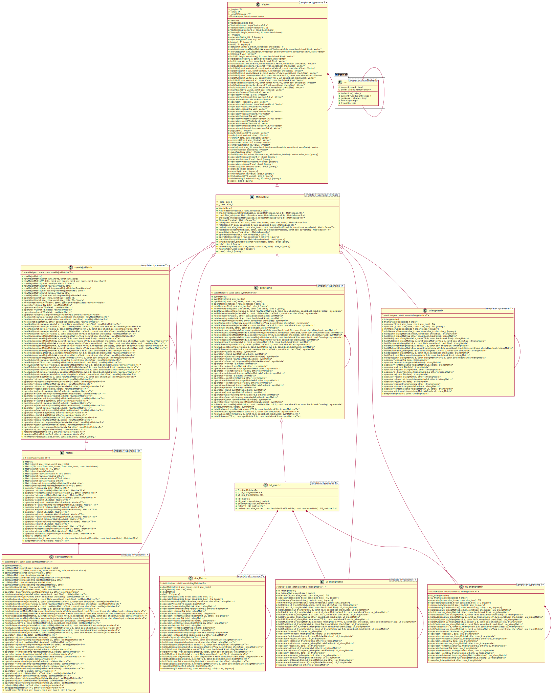

# ESP32AlgebraFilters - PlatformIO referential project
This folder is a referential where the ESP32AlgebraFilters library is developed and tested.
It is not available for installation via PlatformIO Library Manager yet. I need to write clean tests and documentation before that.

## Classes architecture

## License
This project is licensed under the MIT License - see the [LICENSE](lib\linearAlgebra\LICENSE) file for details.