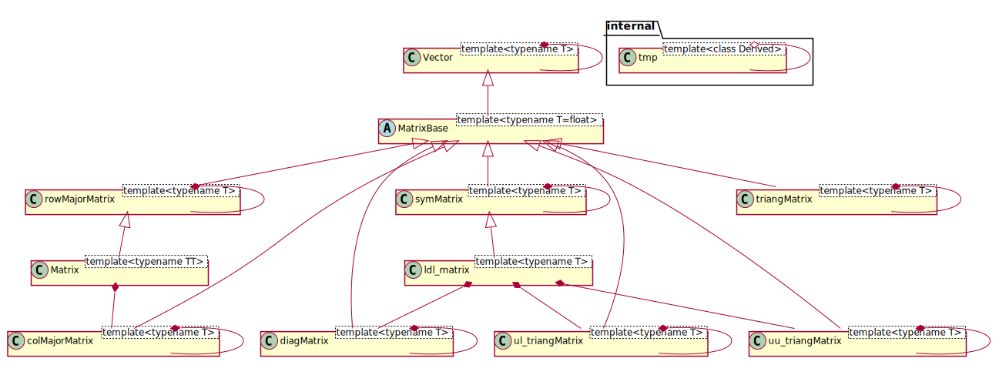

# linear algebra - PlatformIO referential project
## Overview
LinearAlgebra is a lightweight library for manipulation of vectors and matrices, tailored for resource-constrained systems like the ESP32. It provides support for various types of matrices to optimize memory usage and computational performance. The library focuses on iterative implementations to ensure giving developers full control over the mathematical operations performed. Ideal for projects requiring fine-tuned linear algebra computations without unnecessary overhead.

## Classes architecture


## Current state
A lots of classes are already implemented, but only few of them are officially and partially tested.

## Roadmap
- [ ] Unit tests for all classes
- [ ] Documentation for all classes
- [ ] Performance tests
- [ ] More examples
- [ ] Publish on PlatformIO Library Manager

## Testing
To run the unit tests, you can use the following command:
```bash
pio test -e native
```

## License
This project is licensed under the GNU General Public License v3.0 - see the [LICENSE](LICENSE) file for details.
