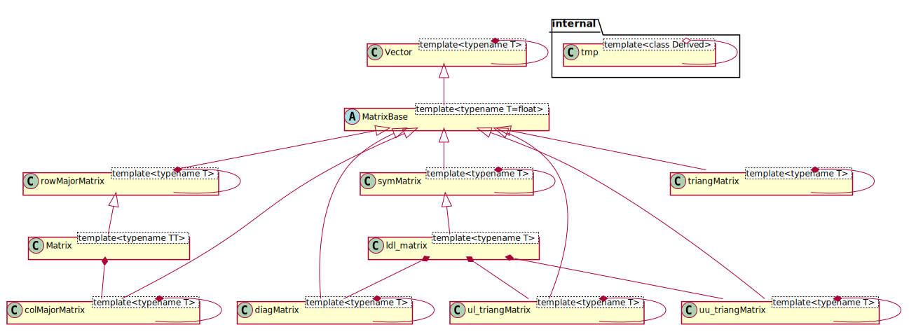

# ESP32AlgebraFilters - PlatformIO referential project
This folder is a referential where the ESP32AlgebraFilters library is developed and tested.
It is not available for installation via PlatformIO Library Manager yet. I need to write clean tests and documentation before that.

## Classes architecture

## Current state
A lots of classes are already implemented, but only few of them are officially and partially tested.

## Roadmap
- [ ] Unit tests for all classes
- [~] Documentation for all classes
- [ ] Performance tests
- [ ] More examples
- [ ] Publish on PlatformIO Library Manager

## License
This project is licensed under the GNU General Public License v3.0 - see the [LICENSE](LICENSE) file for details.